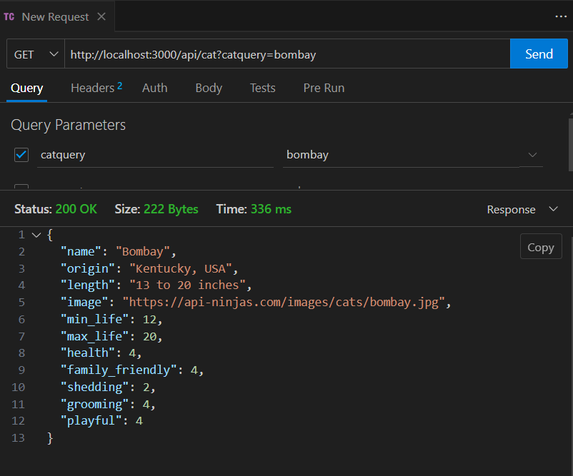
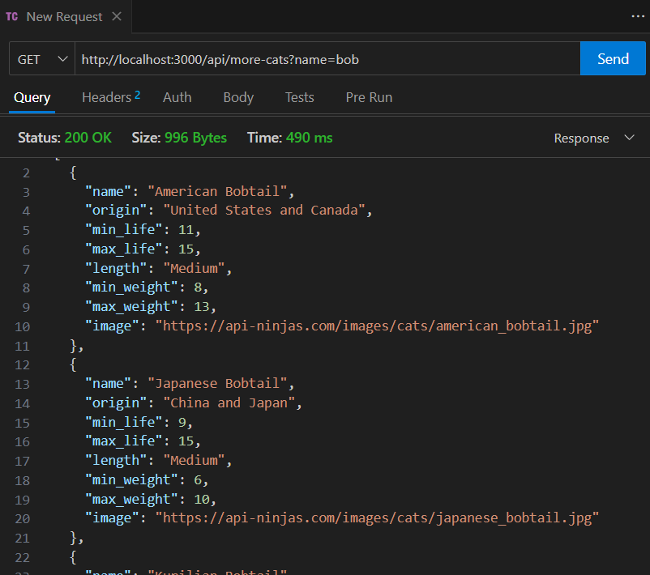
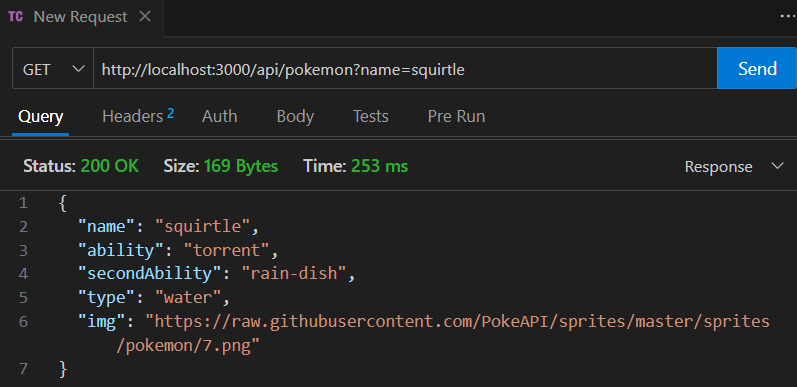
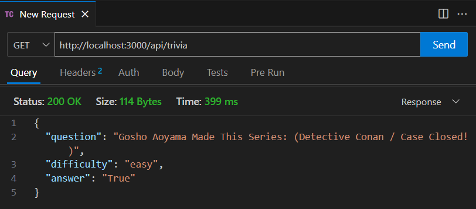
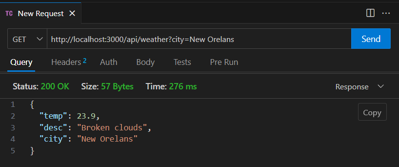

# Cat App

Jump To Updated Documentation : [Updates](#cat-app-updated)  
Jump To Documentation : [API Proxies](#cat-app---api-proxies)

## Day 1: Planning

### Objectives

In this project, I analyzed a mockup to identify key components of a webpage and broke down the user interface into reusable React components. I mapped data from a JSON file to the appropriate components, planned the project's structure, and documented it. Finally, I began coding the project by following a structured approach based on the analysis.

### Mockup Wireframe


### Components

Based on the provided mockup (`mockup-single-cat.png`), the following components were identified:

1. **Header**
   - Description: A navigation bar or website header that appears at the top of the page.
   - Data Required: None
2. **CatCard**
   - Description: A card that can nest other componets like title, image, description.
   - **Title**
     - Description: Displays the name of the cat.
     - Data Required: name (string) from cat-data.json file.
   - **Image**
     - Description: Displays the cat's image.
     - Data Required: image_link (string/url)
   - **Description**
     - Description: Displays rating like information about the cat.
     - Data Required: Examples - family_friendly, general_health, and grooming (number, object)
3. **Support**
   - Description: A CTA section with a button where you can receive support or Like a Cat.
   - Data Required: none (string, button)

## Day 2: Setup

In this project, I started a Next.js project from the ground up and incorporated Tailwind CSS for styling. Through building a splash page, I practiced using both Next.js and Tailwind, while also learning how to set up and test the workflow effectively. Additionally, I established a habit of regularly testing my work throughout the development process.

### Setting Up Project

1. Create a Next.js Project
   Open terminal and run the following command:

```bash
npx create-next-app@latest
```

NOTE: For Window, you can right-click and select 'Show More Options' directly into your project's folder to open the terminal.

Then choose the following options:

- Name of Project: `my-example-app`
- TypeScript: No
- ESLint: Yes
- Tailwind CSS: Yes
- Use src/ directory: Yes
- Use App Router: No
- Customize import alias: No

2. Navigate into project directory:

```bash
cd my-example-app
```

3. Open VS Code:

```bash
code .
```

4. Start the development server:

```bash
npm run dev
```

Note: You can use the already opened terminal or Open a new terminal in VS Code. 5. Open `http://localhost:3000` in browser.

### Creating A Home Component

1. Remove preloaded code from `src/pages/index.js` file.
2. Create a simple component:

```jsx
export default function Home() {
  return (
    <>
      <h1>Welcome to the Cat App!</h1>
    </>
  );
}
```

3. Test it by visiting `http://localhost:3000`. The website should show 'Welcome to the Cat App!'.
4. Implement Tailwind CSS and explore Tailwind's documentation.

```jsx
export default function Home() {
  return (
    <>
      <h1 className="text-center text-4xl font-semibold text-[#03045e]">
        Welcome to the Cat App!
      </h1>
    </>
  );
}
```

5. Save and confirm changes were applied by visiting `http://localhost:3000`.

## Day 3: Components

This project involves building a Cat App that displays a cat image and additional information about the cat. The application is structured using Next.js and Tailwind CSS for styling. The main objective is to create a single page that fetches mock data from a JSON file and presents it through reusable React components.

### Key Components

#### Home (`src/pages/index.js`)

Sets up the homepage with a `NavBar` and `CatFacts` components, displaying a welcoming message and random cat facts.

#### Navbar.jsx

Defines a navigation bar with links to "Home" and "Cat" pages, and includes a logo SVG component.

#### CatLogoSvg.jsx

Contains the SVG for the logo, rendered within the Navbar. Credit: Iconify.

#### CatFacts.jsx

Displays a random cat fact with a button to fetch another fact using `useState`.

#### Cat (`src/pages/cat/index.js`)

The Cat page displays a "Cat of the Day" using mock data from `cat-data.json` and renders the `CatCard` and `CatDetails` components.

#### CatCard.jsx

Displays the cat's name and image using props passed from the parent.

#### CatDetails.jsx

Shows additional details about the cat (origin, life expectancy, etc.) and uses the `StarRating` component to display ratings for attributes like family-friendliness and health.

#### StarRating.jsx

A simple star rating system that visually represents the rating (1-5) with filled and empty stars.

## Screenshots

### Home


### Cat

  


## How To Run Project

First, clone repository and install dependencies:

```bash
npm install
```

Then, run the development server:

```bash
npm run dev
# or
yarn dev
# or
pnpm dev
# or
bun dev
```

Open [http://localhost:3000](http://localhost:3000) with your browser to see the result.  
Cat Page: [http://localhost:3000/cat](http://localhost:3000/cat)

# Cat App Updated

## Overview

This project is part of the Week 4 assignment, which involves fetching data from an API and displaying it in React components. The goal is to practice using React hooks (`useEffect`, `useState`) for handling API requests, state management, and dynamically rendering data in the UI.

The project includes multiple components, two pages that feature cats, and one that fetches Pokémon data as a bonus.

## Components

### FlipCard.jsx

A reusable component that displays cat details with a flipping animation.

#### Props:

- `name`: The name of the cat.
- `imgSrc`: The source URL for the cat's image.
- `origin`: The origin of the cat breed.
- `expectancy`: Life expectancy of the cat.
- `length`: The length of the cat.
- `weight`: The weight range of the cat.

#### Usage:

- Displays a front side with an image and name, and a back side with additional details about the cat.
- Uses the `useState` hook to manage whether the card is flipped or not.

### PokemonCard.jsx

A component that displays a Pokémon's name and image.

#### Props:

- `name`: The name of the Pokémon.
- `imgSrc`: The source URL for the Pokémon's image.

#### Usage:

Uses `PropTypes` to ensure that required props are passed. Shows a Pokémon with hover effects.

### Loading.jsx

A simple loading animation to indicate that data is being fetched.

#### Usage:

- Displays a circular loading animation with CSS transitions.

## Pages

### Cat

A page that fetches and displays the "Cat of the Day" from an API.

#### Features:

- Fetches a single cat's data from the API (`https://cats-cats-cats-demo.deno.dev/cats/bombay`).
- Displays the cat's name, image, and details like origin, life expectancy, and health.

#### Hooks:

- `useEffect` is used to fetch cat data on component mount.
- `useState` is used to manage the fetched data and loading state.

### MoreCats

A page that displays multiple cats using the FlipCard component.

#### Features:

- Fetches an array of cat data from the API with the `multi_cat=true` query parameter.
- Displays each cat in a flipping card layout.

#### Hooks:

- `useEffect` is used to fetch the array of cats on component mount.
- `useState` is used to manage the list of cats and loading state.

### Pokemon

A page that fetches and displays Pokémon data (Pikachu as an example).

#### Features:

- Fetches Pokémon data from the PokéAPI (`https://pokeapi.co/api/v2/pokemon/pikachu`).
- Displays the Pokémon’s name and sprite image.

## Stretch Goals

**Multiple Cats:** Created a more-cats page that fetches multiple cats with the `multi_cat=true` query.

**Error Handling and Loading States:** Managed loading and error states across all pages.

**Custom API:** Added functionality to fetch Pokémon data from the PokéAPI.

**Storybook:** Implemented Storybook to document and test components in isolation.

## Deployment

This project is deployed on Vercel. You can access it at: https://cat-app-khaki.vercel.app/

# Cat App - API Proxies

Cat App is a web application designed to fetch and display data related to cats, Pokémon, trivia questions, and weather. By utilizing a proxy server, the app connects to various external APIs, enhancing user interaction through a sleek interface styled with Tailwind CSS. This project offers a fun and interactive experience, allowing users to explore information across multiple pages while dynamically serving content through Next.js.

## Project Setup

To run the project locally, install dependencies and start the development server:

```bash
npm install
npm run dev
```

Ensure that the environment variables are set as described in the [Environment Variables](#environment-variables) section.

## Environment Variables

Create a .env file at the root of the project to store the necessary API keys:

```
NINJA_API_KEY=<your ninja api key>
WEATHER_API=<your weather api key>
```

## API Endpoints

### `/api/cat`

Fetches data about a specific cat breed.

- **Query Parameter:** `catquery` - The name of the cat breed to search for.
- **Example Request:** `/api/cat?catquery=khao`
- **Response:**

```json
{
  "name": "Khao Manee",
  "origin": "Thailand",
  "length": "Medium",
  "image": "https://example.com/cat.jpg",
  "min_life": 10,
  "max_life": 12,
  "health": 5,
  "family_friendly": 4,
  "shedding": 3,
  "grooming": 2,
  "playful": 5
}
```

### `/api/more-cats`

Fetches an array of cat breeds that match a specific query.

- **Query Parameter:** `name` - A partial or full name for cat breeds to search.
- **Example Request:** `/api/more-cats?name=n`
- **Response:**

```json
[
  {
    "name": "Norwegian Forest Cat",
    "origin": "Norway",
    "min_life": 12,
    "max_life": 16,
    "length": "Large",
    "min_weight": 8,
    "max_weight": 18,
    "image": "https://example.com/cat.jpg"
  },
  ...
]
```

### `/api/pokemon`

Fetches Pokémon data for a specified Pokémon.

- **Query Parameter:** `name` - The Pokémon's name.
- **Example Request:** `/api/pokemon?name=pikachu`
- **Response:**

```json
{
  "name": "Pikachu",
  "ability": "Static",
  "secondAbility": "No second ability",
  "type": "Electric",
  "img": "https://example.com/pikachu.jpg"
}
```

### `/api/trivia`

Fetches a random anime trivia question.

- **Example Request:** `/api/trivia`
- **Response:**

```json
{
  "question": "Who is the main character in Naruto?",
  "difficulty": "medium",
  "answer": "Naruto Uzumaki"
}
```

### `/api/weather`

Fetches current weather data for a specific city.

- **Query Parameter:** `city` - The name of the city.
- **Example Request:** `/api/weather?city=London`
- **Response:**

```json
{
  "temp": 15,
  "desc": "Clear sky",
  "city": "London"
}
```

## Pages

### Cat

Displays details about a specific cat breed, with search functionality to find other breeds.

### More Cats

Shows a list of cat breeds in a flip card layout, with each card displaying key information.

### Pokemon

Displays data about a specific Pokémon, including abilities, type, and an image.

### Trivia

Fetches and displays a random anime trivia question, including the question difficulty. The trivia page utilizes Tailwind CSS to apply hover effects with opacity changes, allowing users to reveal the answer when hovering over the trivia question.

## Thunder Client Collection

Screenshots of the Postman request for the APIs

### /api/cat



### /api/more-cats



### /api/pokemon



### /api/trivia



### /api/weather



## Deployed Link

You can view the live project [here](https://cat-app-khaki.vercel.app/).

## Challenges and Solutions

### Challenge: Handling the 429 "Too Many Requests" Error

When implementing the trivia feature, I encountered a significant issue with the Open Trivia Database API, where repeated requests would often result in a 429 status error (Too Many Requests). This error occurs when an API’s rate limit is exceeded by making too many requests within a short timeframe. Because trivia data is fetched each time a user loads the page or requests new data, it was essential to handle this error effectively.

### Solution: Exponential Backoff Retry Mechanism

To address this, I implemented an exponential backoff strategy. This technique delays each retry attempt progressively longer after each 429 error. Here’s how I approached it:

1. **Error Detection and Retry Logic:** When a 429 error was detected, I set up the `fetchTrivia` function to retry up to 5 times. Each retry would increase the waiting time by doubling the previous delay, helping avoid overwhelming the API and improving chances of a successful fetch.

2. **Exponential Backoff Calculation:** For each retry attempt, I calculated the delay as `Math.pow(2, attempt) * 1000` milliseconds (1s, 2s, 4s, 8s, etc.), which prevented the function from retrying too quickly.

3. **Fallback to Error Display:** After 5 unsuccessful attempts, the code stops retrying and displays an error message to inform users that trivia data couldn't be loaded.

#### Code Snippet for Backoff Logic:

```js
if (error.message.includes("429") && attempt <= 5) {
  const backoffTime = Math.pow(2, attempt) * 1000;
  setTimeout(() => {
    fetchTrivia(attempt + 1);
  }, backoffTime);
} else {
  setError(error.message);
}
```

### What I Learned

This challenge taught me the importance of handling API rate limits gracefully and provided insights into common strategies like exponential backoff for retrying requests. Implementing this solution has strengthened my understanding of error handling in asynchronous JavaScript functions and given me practical experience in optimizing API request patterns to improve user experience.
